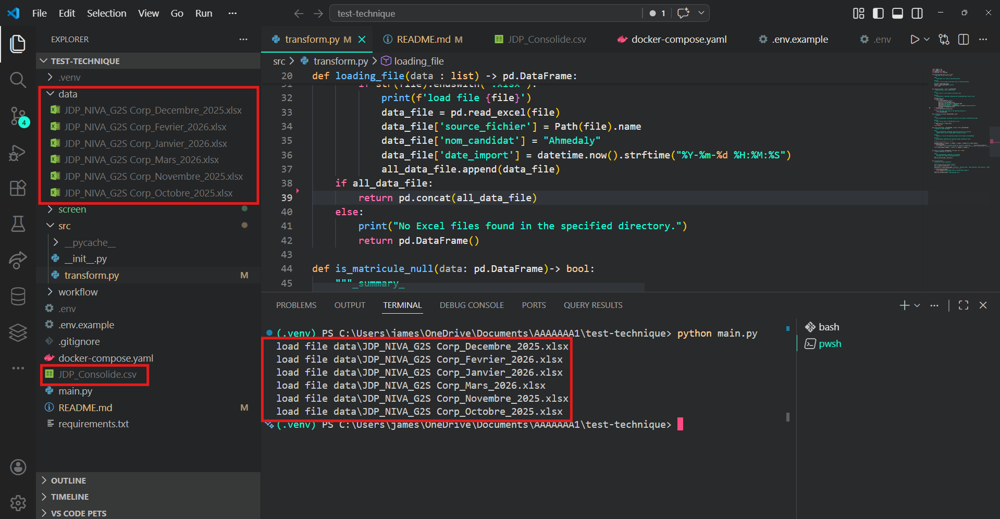
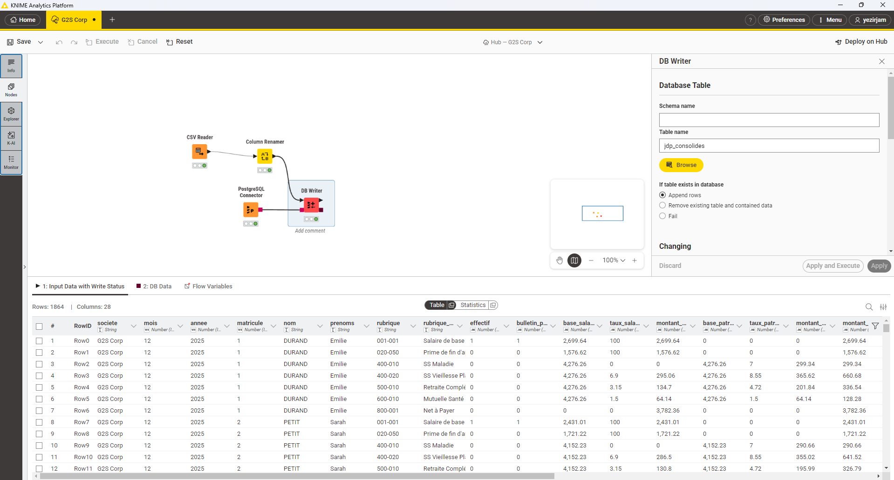
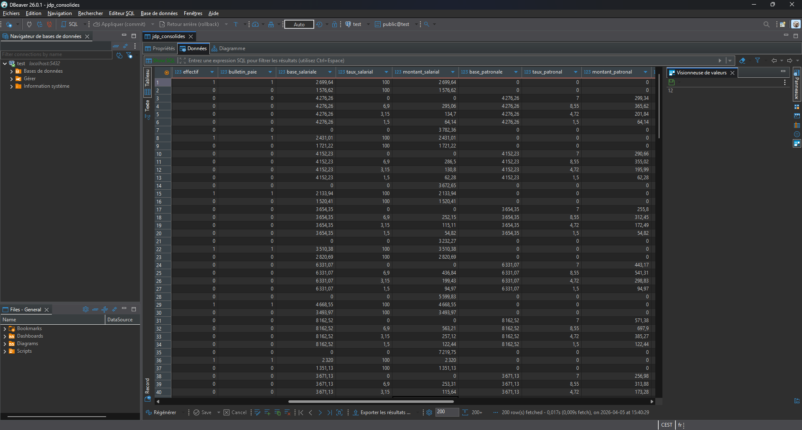
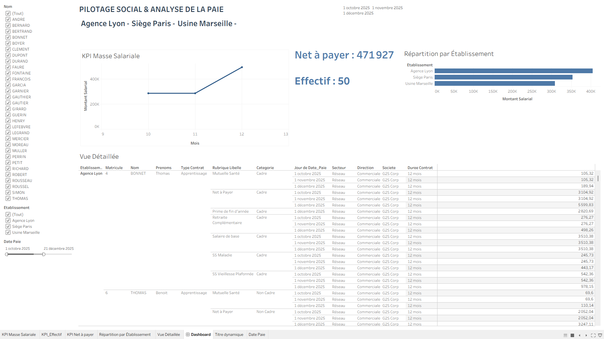
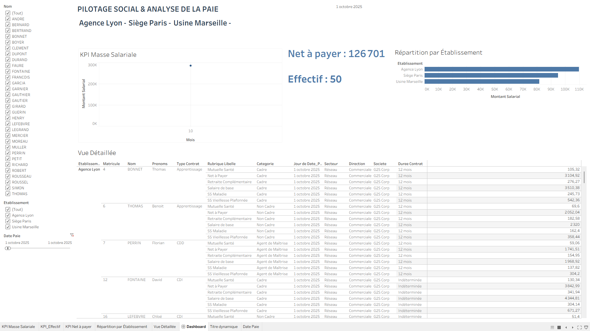

# G2S Analytics - Test Technique

## Contexte du Test

Bienvenue chez G2S Analytics. Ce test technique simule une mission de structuration et de restitution de données sociales pour notre client : **G2S Corp**.  
Vous disposez de 2 jours et 10 heures pour traiter l'intégralité de la chaîne de donnée, de la préparation brute à la dataviz finale.

## Structure du Projet

Ce dépôt contient la solution complète pour le test technique, organisée selon les étapes suivantes :

- **`main.py`** : Script principal Python pour lancer le processus de préparation des données (Étape 1).
- **`src/transform.py`** : Module Python contenant toutes les fonctions de transformation et consolidation des données.
- **`requirements.txt`** : Liste des dépendances Python nécessaires.
- **`docker-compose.yaml`** : Configuration Docker pour déployer une base de données PostgreSQL locale.
- **`.env`** : Fichier de configuration des variables d'environnement pour la base de données (non versionné pour des raisons de sécurité).
- **`.env.example`** : Exemple de fichier `.env` à copier et remplir.
- **`data/`** : Dossier contenant les fichiers Excel bruts des journaux de paie (6 fichiers pour Octobre 2025 à Mars 2026).
- **`workflow/G2S-Corp.knwf`** : Workflow KNIME pour l'intégration en base de données (Étape 2).
- **`screen/`** : Dossier pour les captures d'écran des différentes étapes d'exécution.
- **`JDP_Consolide.csv`** : Fichier consolidé généré par le script Python (exporté au format CSV pour KNIME).

## Fonctionnement du Code

### Étape 1 : Python (Préparation & Traçabilité des Sources)

#### Objectif
Créer un script qui concatène 6 fichiers Excel de journaux de paie (format NIVA) tout en assurant leur traçabilité.

#### Tâches Réalisées
1. **Lecture et concaténation** : Chargement des 6 fichiers Excel avec `pandas` et réunion en un seul DataFrame.
2. **Ajout de métadonnées** :
   - Colonne `source_fichier` : Nom exact du fichier Excel d'origine pour chaque ligne.
   - Colonne `date_import` : Date et heure courante de l'exécution du script.
   - Colonne `nom_candidat` : Nom du candidat (ajoutée pour traçabilité).
3. **Nettoyage basique** :
   - Vérification de l'absence de valeurs nulles sur la colonne `Matricule`.
   - Conversion des colonnes de montants (`Base salariale`, `Montant salarial`, etc.) au format numérique flottant.
4. **Export** : Export du DataFrame consolidé en CSV (`JDP_Consolide.csv`).

#### Exécution
1. Placer les 6 fichiers Excel dans le dossier `data/`.
2. Installer les dépendances : `pip install -r requirements.txt`
3. Lancer le script : `python main.py`

Le script génère automatiquement `JDP_Consolide.csv` dans le répertoire racine.

#### Code Principal (`src/transform.py`)
- `get_paths()` : Récupère la liste des fichiers Excel dans `data/`.
- `loading_file()` : Charge et concatène les fichiers avec ajout des métadonnées.
- `is_matricule_null()` : Vérifie l'absence de nulls dans `Matricule`.
- `convert_amount()` : Convertit les colonnes numériques en float64.
- `export_to_csv()` : Exporte le DataFrame en CSV.
- `initialisation()` : Fonction principale orchestrant tout le processus.

### Étape 2 : KNIME (Intégration en Base de Données PostgreSQL)

#### Objectif
Construire un workflow KNIME qui intègre le fichier `JDP_Consolide.csv` dans une table PostgreSQL.

#### Tâches Réalisées
1. **Lecture des données** : Nœud de lecture CSV pour charger `JDP_Consolide.csv`.
2. **Standardisation des noms de colonnes** : Renommage en snake_case (ex: `Base salariale` → `base_salariale`).
3. **Connexion DB & Insertion** :
   - Configuration PostgreSQL via Docker Compose.
   - Utilisation du nœud `DB Writer` pour insertion dans la table `jdp_consolides`.

#### Configuration Base de Données
1. Copier `.env.example` vers `.env` et remplir les variables :
   ```
   POSTGRES_USER=votre_user
   POSTGRES_PASSWORD=votre_password
   POSTGRES_DB=g2s_db
   ```
2. Lancer PostgreSQL : `docker-compose up -d`
3. Exécuter le workflow KNIME `workflow/G2S-Corp.knwf`.

Le workflow KNIME est fourni dans `workflow/G2S-Corp.knwf`.

### Étape 3 : PostgreSQL (Schéma & Contrôle)

#### Schéma de la Table
```sql
CREATE TABLE IF NOT EXISTS public.jdp_consolides (
    id SERIAL PRIMARY KEY,
    societe VARCHAR(100),
    mois INTEGER,
    annee INTEGER,
    matricule VARCHAR(50),
    nom VARCHAR(100),
    prenoms VARCHAR(100),
    rubrique VARCHAR(50),
    rubrique_libelle VARCHAR(255),
    effectif INTEGER,
    bulletin_paie INTEGER,
    base_salariale NUMERIC(15,2),
    taux_salarial NUMERIC(10,2),
    montant_salarial NUMERIC(15,2),
    base_patronale NUMERIC(15,2),
    taux_patronal NUMERIC(10,2),
    montant_patronal NUMERIC(15,2),
    montant_total NUMERIC(15,2),
    etablissement VARCHAR(150),
    direction VARCHAR(150),
    secteur VARCHAR(150),
    type_paie VARCHAR(100),
    categorie VARCHAR(100),
    type_contrat VARCHAR(100),
    duree_contrat VARCHAR(100),
    nom_candidat VARCHAR(100),
    source_fichier VARCHAR(255),
    date_import TIMESTAMP
);
```

#### Exercice 1 : Requête de Contrôle (Data Quality)
Vérifier la somme des montants de "Salaire de base" pour l'établissement "Agence Lyon" au mois de Mars 2026.

#### Exercice 2 : Requête Analytique (Pilotage)
Calculer la masse salariale brute totale et le Net à Payer total par mois et par établissement, trié par mois croissant, sur les 6 mois de l'historique (T4 2025 - T1 2026).

### Étape 4 : Tableau (Visualisation)

#### Objectif
Créer un dashboard interactif sur Tableau pour le pilotage social.

#### Vues Réalisées
1. **Vue Analytique** : Masse salariale totale par mois, répartition par établissement, effectif moyen.
2. **Vue Détaillée** : Tableau interactif avec filtres par établissement, nom, mois (excluant `source_fichier` et `date_import`).

#### Livrables
- Lien Tableau Public ou fichier `.twbx` zippé.
- Captures d'écran dans `screen/`.

## Captures d'Écran

### Extraction des Informations
Placer les fichiers Excel dans `data/`, puis exécuter `python main.py` :



*Capture d'écran montrant la console lors de l'exécution du script Python, avec les messages de chargement des fichiers.*

### Exécution du Workflow KNIME


*Capture d'écran du workflow KNIME avec tous les nœuds en vert (succès).*

### Insertion en Base de Données


*Print-screen du client SQL montrant les données insérées dans `jdp_consolides`.*

### Dashboard Tableau



*Captures d'écran des vues analytique et détaillée du dashboard Tableau.*

## Pourquoi les Données CSV ne Sont Pas Publiées

J'ai préféré ne pas publier ces données sur GitHub car j'ai voulu jouer le jeu en ne publiant pas des informations qui peuvent être sensibles dans un vrai contexte. Les fichiers Excel bruts et le CSV consolidé contiennent des données personnelles (noms, matricules, montants salariaux) qui, dans un environnement réel, devraient être traitées avec confidentialité et ne pas être exposées publiquement.

## Fonctionnement du .env

Le fichier `.env` contient les variables d'environnement nécessaires pour la configuration sécurisée de la base de données PostgreSQL :

- `POSTGRES_USER` : Nom d'utilisateur pour la connexion à PostgreSQL.
- `POSTGRES_PASSWORD` : Mot de passe associé.
- `POSTGRES_DB` : Nom de la base de données.

Ce fichier n'est pas versionné (ajouté à `.gitignore`) pour éviter l'exposition accidentelle des credentials. Il est chargé par Docker Compose lors du déploiement de la base de données, assurant une séparation claire entre le code et la configuration sensible.

## Installation et Exécution Complète

1. **Cloner le dépôt** : `git clone https://github.com/Yezir971/G2S-Groupe.git`
2. **Placer les données** : Ajouter les 6 fichiers Excel dans `data/`.
3. **Configurer l'environnement** :
   - `cp .env.example .env` et éditer avec vos credentials.
   - `pip install -r requirements.txt`
4. **Étape 1** : `python main.py`
5. **Étape 2** : Lancer PostgreSQL avec `docker-compose up -d`, puis exécuter le workflow KNIME.
6. **Étape 3** : Exécuter les requêtes SQL dans PostgreSQL.
7. **Étape 4** : Ouvrir le dashboard Tableau.

## Technologies Utilisées

- **Python** : Pandas, NumPy, OpenPyXL
- **KNIME** : ETL et intégration base de données
- **PostgreSQL** : Base de données relationnelle
- **Docker** : Conteneurisation de la base de données
- **Tableau** : Visualisation de données

## Auteur

Ahmedaly James - Data Analyst chez G2S Analytics ;)